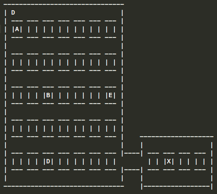

# Proyecto 1
## Descripcion
Crear una simulacion de un Taxi en una ciudad como la
 descrita en el siguiente [mapa](mapas/mapa1.txt):

* 

### La simulacion cuenta con las siguientes intrucciones:

 Instruccion_____   |Descripcion
--------------------|---------- 
[I][x] pasear         | El taxi recorre la ciudad **tratando** de no repetir caminos
[x] buscar          | El taxi recorre la ciudad en busca de clientes
[x] mostar [on off] | Muestra/Oculta los caminos visitados y hacia donde se dirige. Ver [mapa](mapas/buscando-mostrar-on.txt) con **mostrar on**, el orden de los numeros muestra la prioridad del camino
[x] animar  N       | La simulacion avanza cada N milliseconds, mostrando en pantalla el estado acutal. N = 0 detiene todo calculo. N debe iniciar en 0
[x] ruta [on off]   | Cuando aplique, Oculta o Imprime  la ruta optima en el mapa
clientes N          | Agrega N clientes aleatoriamente, con destino aleatorio. Con N=0 elimina los clientes
cliente C1 C2       | Coloca un cliente en la cuadra C1. El C2 indica donde desea ir
[I] parquear C      | El taxi se desplaza a la cuadra C y espera

* [I] Ignora los clientes
* [x] Parte de la funcionalidad minima
* C corresponde a cualquier cuadra en el mapa
* El taxi siempre utiliza la ruta optima cuando ocupa ir de un punto especifico a otro punto
* Si el cliente se encuentra en el mapa a la hora de cargar se le asigna un destino aleatorio

Cuando un cliente llega a su destino se elimina del mapa

## Ejemplos

* [mostrar on](mapas/buscando-mostrar-on.txt)
* [parquear D](mapas/parquear.txt)
* [cliente B X](mapas/cliente-B-X.txt)
* [clientes 2](mapas/clientes-2.txt)

## Requerimientos Tecnicos
1. El programa:
  * Debe ser capaz de mantenerse corriendo mientras recibe instrucciones
  * Inicia con "animar 0"
1. Interface de usuario:
  * Mostrar la simulacion imprimiendo el mapa con los indicadores necesarios (Puede utilizar la consola)
  * La entrada no debe bloquear el despliegue en consola. Por ejemplo en java puede abrir una ventana de Swing para recibir las instrucciones
  * Queda a discrecion del implementador utilizar otros medios para mostrar y recibir informacion, siempre y cuando mantenga y/o extienda funcionalidad
1. Git
  * El proyecto debe estar en un branch aparte llamado proyecto1
  * La version final entregable debe estar en master
  * La descripcion del commit es importante y debe reflejar el estado acutal del programa
  * Se recomienda hacer commit cada cierto tiempo. El hecho de que no compile no es importante
  

* Las letras y simbolos en el mapa se pueden modificar a voluntad.

## Codigo de Honor - Proyecto 1
Por este medio, yo: _______________________________________, como estudiante activo del Instituto Tecnologico de Costa Rica numero de carnet ________________, reconozco que con mi trabajo represento a la benemerita institucion y bajo esta responsabilidad y orgullo me comprometo a aplicar las normas mas altas de etica profesional en el desarrollo de proyecto programado numero uno del curso de Inteligencia Artificial. Doy fe con esta nota que no compartire codigo ni soluciones con mis compañeros, que no tratare de encontrar la solucion a los problemas por medios electronicos como internet, y que sere el unico en trabajar en la elaboracion del codigo, en mis reportes y en esta tarea programada, y en todos los problemas que en ella se encuentran. Comprendo que la copia de codigo o programacion en conjunto tiene como resultado una evaluacion de 0 en el proyecto

* Voy a plantear mis dudas como [Issues](https://github.com/luiskarlos/IA-117/issues) para que otros puedan participar y esclarecer dudas
  * El titulo del issue debe iniciar con:
  * **Proyecto 1** - 
  * Seguido de su comentario u observacion

## Revision
 
 Dificultad    |Dificultad | Cantidad | Valor  | Total
----------    |---------- | ---------| ------ | -------------
[x] Funcionalidad Minima |           | 1        | 10     | 10
Funcionalidad Completa |           | 1        | 10     | 10
Git Historial |           | 1        | 10     | 10
*Modificacion |Simple     | 5        | 5      | 25
*Modificacion |Mediana    | 2        | 10     | 20
*Modificacion |Dificil    | 1        | 20     | 25
 
 * *Modificacion durante la revision
 * Si el implementador lo desea puede agregar funcionalidad que **PODRIA** ser usada para reemplazar las modificaciones en la entrega. (Queda a criterio del que revisa determinar si aplica o no como modificacion y la dificultad). Originilidad y creatividad son puntos importantes. Documentar en el readme estos features en una seccion llamada **Adcionales** describir en una tabla con una colunma de nombre y otra de descripcion. (Ver Ejemplo)
 * Usar [info.json](info.json) en proyecto para su proyecto.

## Adicionales (Esta seccion es de ejemplo)
Nombre    |Descripcion
----------|---------- 
nnnnn     | ddddddddd

